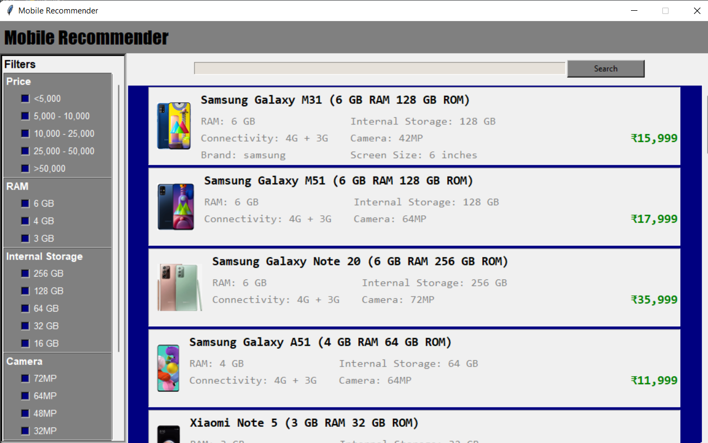
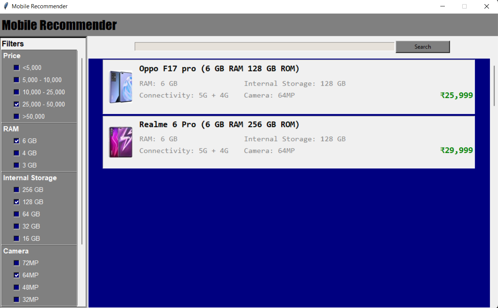

<p align="center">
 <font size="6"> INT-213 : PYTHON PROGRAMMING</font>
</p>
<hr>

### Faculty : Usha Mittal
#### Lovely Professional University, <br> Jalandhar - Punjab, 144411

<p align="center">
 <font size="6">  PROJECT DETAILS </font>
</p>
<hr>

## Title : Phone Recommender System
### Author : Ankit Ojha  (12104212)
### Technology : Tkinter (Tk)

<hr>


<p align="center">
 <font size="6">  SCRENSHOTS</font>
</p>
<hr>

### IMG-1 : Main screen of the project


### IMG-2 : Setting price range and camera for getting desired choice of mobile



### Description :
Here multiple filters are applied on the page to obtain some specific mobiles as per the required multiple filters. This enables the user to select a mobile with more flexibility as per their choice and even lets the viewers get the best recommendation for their product.

<p align="center">
 <font size="6">  HOW TO USE?</font>
</p>
<hr>

### Clone Project :
## ⚡ Installation
**1. Clone this repo by running either of the below commands.**

    https : `git clone https://github.com/ankitojha07/PhoneRecommender-Python.git`
   
  
    ssh : `git clone git@github.com:ankitojha07`


**2. Now, run the following commands:**

  ```bash
cd PhoneRecommender-Python
```
You will find all project files here.

**2. Now, run your project to see the output:**

```
python3 main.py
```
###
**Happy Coding < / >** <br>
Ankit Ojha <br>
ankitoha1409@gmail.com
